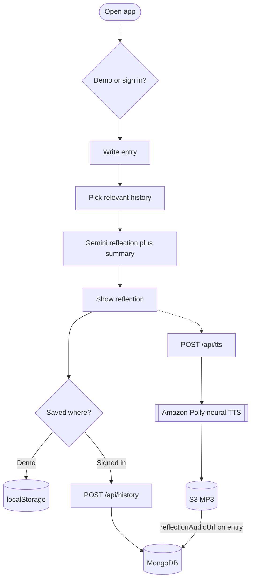

# Serenity Journal

A clean, calming journaling app that generates thoughtful AI reflections to support mental wellness.

## Features

- **AI reflections + summaries**: Generates an empathetic reflection and a one-line summary for each entry.
- **History**: View, delete, or clear past entries.
- **Entity awareness**: Extracts and reuses people/places/events context across recent entries.
- **Highlights**: The model returns short phrases from the reflection text; the UI shows them as **underlined** passages (category hinted by underline color; hover for the label).
- **Reflection voice (TTS)**: Signed-in users can generate speech via **Amazon Polly**; audio is stored in **S3**, and **`reflectionAudioUrl` is written on the journal entry in MongoDB** (see `POST /api/tts`). Demo mode does not use TTS.
- **Auth + demo mode**:
  - **Google OAuth** sign-in (NextAuth).
  - **Demo Mode** (no sign-in; stores data locally in the browser).
  - **Dev Login** provider appears only when `NODE_ENV=development`.

## Tech stack

- **Next.js 16** (App Router) + **React 19**
- **NextAuth v5 (beta)** for authentication
- **MongoDB** + **Mongoose**
- **Tailwind CSS**
- **Gemini API** via `@google/genai` (reflections, embeddings)
- **AWS Polly** + **S3** (`@aws-sdk/client-polly`, `@aws-sdk/client-s3`) for optional TTS

## End-to-end flow

Past entries are **ranked for context** (embeddings by default; optional fast path when history is tiny — see env table). The dashed branch is optional **TTS**: **Amazon Polly** synthesizes speech, audio is stored in **S3**, and **`reflectionAudioUrl`** is saved on the entry in **MongoDB**. Mermaid renders on GitHub and many editors.



## Getting started

### Prereqs

- **Node.js** (recommended: current LTS)
- A **MongoDB** database (local or hosted)
- A **Gemini API key**
- (Optional) Google OAuth credentials for sign-in
- (Optional) AWS credentials + S3 bucket for reflection TTS

### Install

```bash
npm install
```

### Environment variables

Create `.env.local` (recommended) or `.env`. **Do not commit secrets**; rotate any key that has ever been pushed to git.

| Variable | Required | Used for |
| --- | --- | --- |
| `NEXT_PUBLIC_GEMINI_API_KEY` or `GEMINI_API_KEY` | Yes | Gemini (reflections, embeddings, entity/topic prep) |
| `NEXT_PUBLIC_GEMINI_MODEL` or `GEMINI_MODEL` | No | Text model id (default: `gemini-3.1-flash`). Use `NEXT_PUBLIC_` if reflection runs in the browser. |
| `AUTH_SECRET` | Yes | NextAuth session/JWT signing |
| `GOOGLE_CLIENT_ID` / `GOOGLE_CLIENT_SECRET` | Yes* | Google OAuth (*unless Demo Mode / Dev Login only) |
| `MONGODB_URI` | Yes* | MongoDB for entries + preferences (*not required for Demo Mode) |
| `NEXT_PUBLIC_ENABLE_GOOGLE_AUTH` | No | Set to `true` to enable Google sign-in in the UI |

**Reflection speed (optional):**

| Variable | Default | Used for |
| --- | --- | --- |
| `NEXT_PUBLIC_REFLECTION_EMBED_HISTORY_MAX` or `REFLECTION_EMBED_HISTORY_MAX` | `25` | Max past entries embedded for relevance scoring |
| `NEXT_PUBLIC_REFLECTION_FAST_PATH` or `REFLECTION_FAST_PATH` | off | If `true`, skip embeddings when history has ≤ 3 entries (recency-only context) |

**TTS (optional, signed-in users):**

| Variable | Required for TTS | Used for |
| --- | --- | --- |
| `AWS_ACCESS_KEY_ID` / `AWS_SECRET_ACCESS_KEY` | Yes | S3 upload + Polly |
| `AWS_REGION` or `S3_REGION` | Yes | AWS region |
| `AWS_S3_BUCKET_NAME` or `S3_BUCKET` | Yes | Audio object bucket |
| `S3_PUBLIC_BASE_URL` | No | If set, public URLs use this base instead of virtual-hosted S3 style |
| `TTS_VOICE_ID` | No | Polly voice (default: `Joanna`) |

Notes:

- **Demo Mode** does not require a database; entries stay in `localStorage`.
- TTS is implemented by `POST /api/tts` (server-side); the client only calls that route.

### Run dev server

```bash
npm run dev
```

Then open `http://localhost:3000`.

## Usage

### Sign in options

- **Google**: uses NextAuth Google provider.
- **Demo Mode**: click “Try Demo — No sign-in required”. This sets a `demo-mode=true` cookie for ~24 hours.
- **Dev Login** (development only): available on the login screen when running locally in dev; signs in as a fixed dev user.

### History storage

- **Authenticated users**: entries and preferences are stored in MongoDB and served through API routes under `app/api/*`.
- **Demo mode**: entries/preferences are stored in the browser (`localStorage`) and are not persisted to the database.

## Scripts

```bash
npm run dev                  # start Next.js dev server
npm run build                # production build
npm run start                # production server
npm run migrate:pg-to-mongo  # one-off Postgres → Mongo migration helper (see script)
```

## Deployment

This is a standard Next.js app. For production configure:

- Required env vars above on your host (e.g. Vercel)
- A reachable **MongoDB** cluster
- For TTS: IAM user/key or role **allowed** for **Polly `SynthesizeSpeech`** and **S3 `PutObject`** on your bucket; objects should be **readable** at the URL you store (public bucket or CDN base via `S3_PUBLIC_BASE_URL`)

## Security notes

- Treat journal entries as sensitive. Keep `AUTH_SECRET`, OAuth secrets, DB URLs, Gemini keys, and AWS keys out of git.
- Rotate any credential that was ever committed or leaked.

## Docs

- See `docs/gemini-live-api.md` for notes on Gemini Live API (not required for the core app).
- Implementation notes: `ENTITY_IMPLEMENTATION.md`, `BUGFIX_HIGHLIGHTS_AND_CLEAR.md` (if present in your tree).
