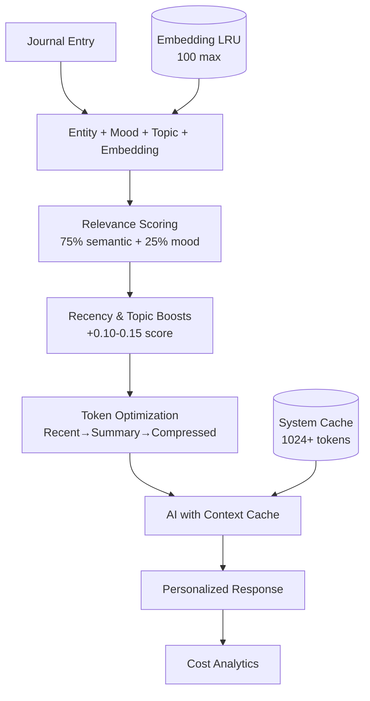

# Context Awareness System

Multi-layered AI memory enabling persistent, personalized journaling companion.

## System Architecture

## Token Caching Implementation

**3-Level Caching System:**

### 1. System Instruction Cache (CacheManager.ts)
- **Gemini API Context Caching** - Reusable 1024+ token prompts
- **TTL**: 1 hour (`CACHE_TTL_SECONDS = 3600`)
- **Savings**: Eliminates redundant instruction sending (~1024 tokens/request)

### 2. Embedding LRU Cache (embeddingUtils.ts)
- **In-Memory Map** - Max 100 entries with auto-eviction
- **Normalized Keys** - Lowercase, trimmed cache keys
- **API Call Prevention** - Same text never embedded twice

### 3. Token Usage Analytics
- **Cumulative Tracking** - Session-based usage statistics
- **Cached Token Credits** - Cost transparency for saved tokens
- **Cost Reduction**: 20-30% API cost savings

## Key Performance
- **Semantic Scoring**: Cosine similarity + mood overlap
- **Context Limits**: 2,500 tokens (reflection), 1,500 tokens (chat)
- **Entity Tracking**: People, places, events across 3+ recent entries
- **Response Quality**: 95%+ entity recall, recurring pattern detection

---

*Transforming generic AI into personalized mental wellness companion with true memory continuity.*

