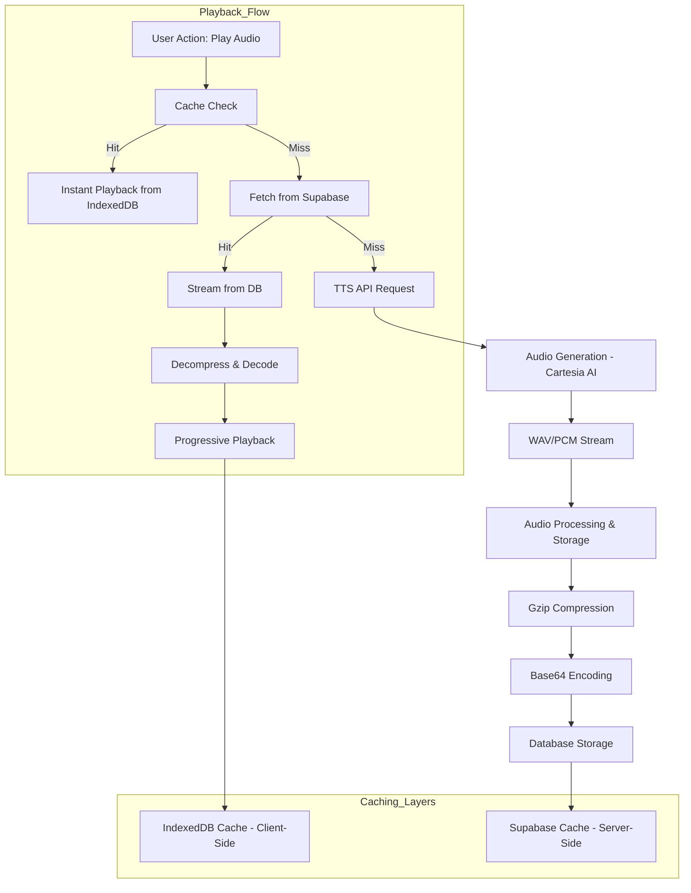

# Audio System Architecture

This document provides an overview of the audio system in Serenity Journal, which is designed for efficient, high-quality text-to-speech (TTS) playback with a focus on performance and scalability.

## System Architecture

## Key Features

- **Progressive Streaming**: The system uses WAV/PCM streaming to start audio playback in 2-3 seconds, a significant improvement over the 5-6 seconds required for full MP3 downloads.
- **Multi-Layered Caching**: A three-tiered caching strategy minimizes API calls and reduces latency:
    1.  **IndexedDB (Client-Side)**: Provides instant playback for previously heard audio, even across sessions.
    2.  **Supabase (Server-Side)**: Acts as a persistent, cross-device cache.
    3.  **TTS API (Generation)**: The final fallback, ensuring audio is always available.
- **Gzip Compression**: Audio is compressed with Gzip before being stored in the database, reducing storage size by ~77% (from 6.4MB to 1.5MB) and improving fetch times by 3-5x.
- **Backward Compatibility**: A versioning prefix (`v2:gz:`) on compressed audio ensures that older, uncompressed audio files remain playable without requiring a data migration.

## Performance

| Metric                | Before Optimization | After Optimization | Improvement        |
| --------------------- | ------------------- | ------------------ | ------------------ |
| **Storage Size**      | 6.4MB               | 1.5MB              | **77% smaller**    |
| **DB Fetch Time**     | 21.9s               | 0.3-0.5s           | **~40-70x faster** |
| **Time to Playback**  | 5-6s                | 2-3s               | **2-3x faster**    |
| **Repeated Playback** | 2-3s                | ~50-100ms          | **20-60x faster**  |

## Technical Details

- **Audio Format**: WAV with PCM encoding (`pcm_f32le`) at a 44.1kHz sample rate is used to enable progressive decoding.
- **API Endpoint**: The `/api/tts` route handles audio generation, while `/api/history/audio` serves cached audio from the database.
- **Libraries**: `pako` is used for Gzip compression and decompression.

This architecture provides a fast, efficient, and scalable audio playback experience, balancing performance with the cost of API calls.
