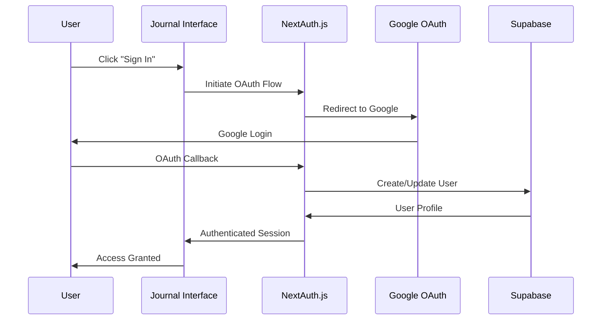
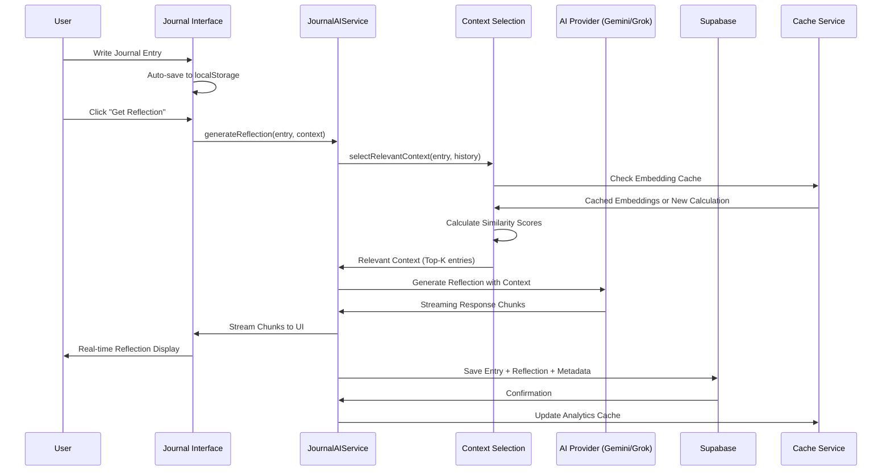
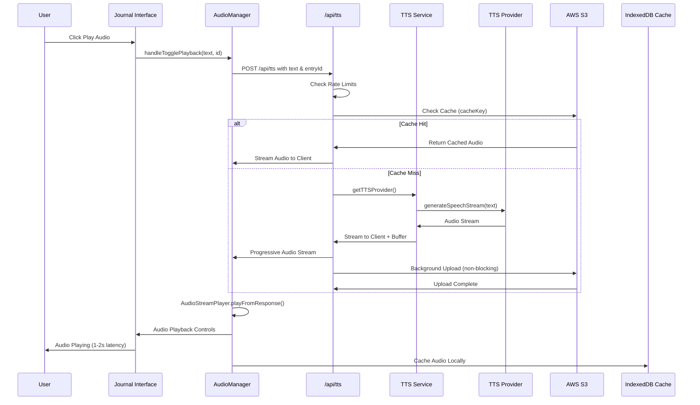
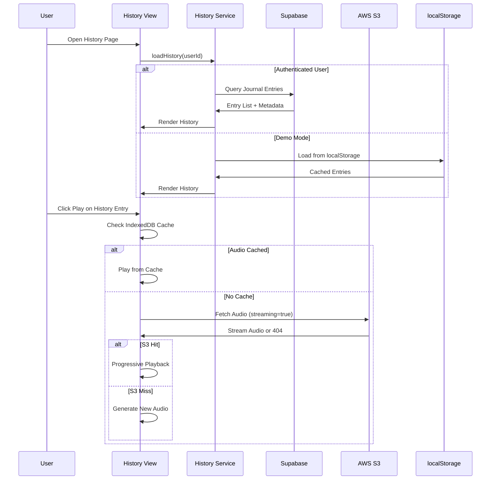
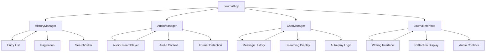
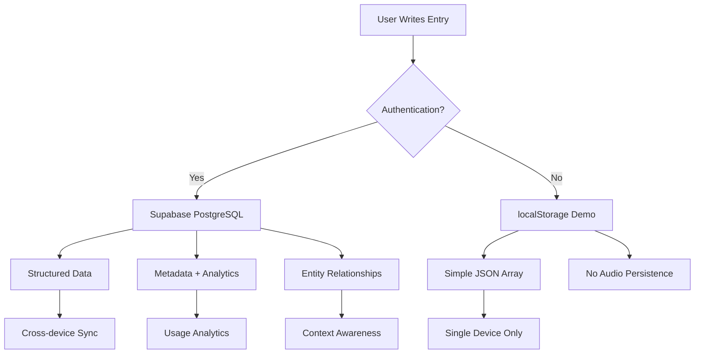
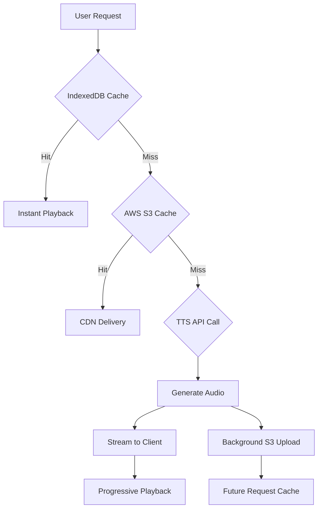
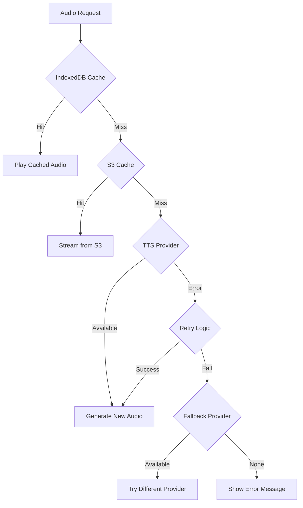
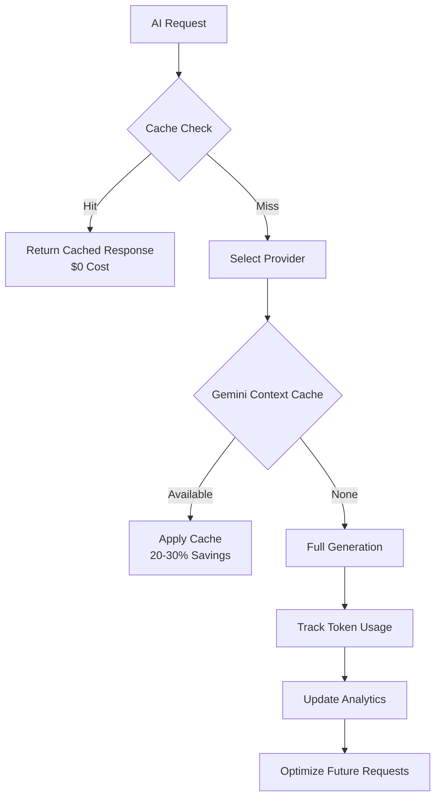

# End-to-End Workflow: Serenity Journal AI

## Complete System Architecture & Data Flow

```mermaid
graph TB
    %% User Interface Layer
    subgraph "User Interface Layer"
        UI[Journal Interface<br/>React Components]
        Auth[Authentication<br/>NextAuth.js + Google OAuth]
        State[State Management<br/>Compound Components]
    end

    %% Client-Side Processing
    subgraph "Client Processing"
        Input[User Input<br/>Journal Entry]
        ContextSel[Context Selection<br/>Semantic Scoring]
        Streaming[Streaming Display<br/>Real-time UI Updates]
        AudioPlay[Audio Playback<br/>AudioStreamPlayer]
    end

    %% API Layer
    subgraph "API Layer"
        TTS_API[TTS API<br/>/api/tts]
        History_API[History API<br/>/api/history]
        Auth_API[Auth API<br/>NextAuth Handlers]
    end

    %% Service Layer
    subgraph "Service Layer"
        JournalSvc[JournalAIService<br/>Orchestrator]
        TTSSvc[TTS Provider<br/>Factory Pattern]
        HistorySvc[History Service<br/>CRUD Operations]
        CacheSvc[Cache Service<br/>LRU + Analytics]
    end

    %% AI Providers
    subgraph "AI Providers"
        Gemini[Google Gemini<br/>gemini-1.5-flash/pro]
        Grok[Grok via OpenRouter<br/>x-ai/grok-4.1-fast]
        CartesiaTTS[Cartesia TTS<br/>sonic-2 model]
        GeminiTTS[Gemini TTS<br/>30+ voices]
        ElevenLabsTTS[ElevenLabs TTS<br/>Ultra-low latency]
        FishTTS[Fish Audio TTS<br/>Emotion control]
    end

    %% Data Layer
    subgraph "Data Layer"
        Supabase[(Supabase PostgreSQL<br/>User Data + Metadata)]
        S3[(AWS S3<br/>Audio Files)]
        IndexedDB[(IndexedDB<br/>Client Cache)]
        LocalStorage[(localStorage<br/>Demo Mode)]
    end

    %% External Systems
    subgraph "External Systems"
        Google[Google OAuth<br/>User Authentication]
        OpenRouter[OpenRouter API<br/>Multi-Model Access]
        GoogleAI[Google AI API<br/>Gemini Models]
        Cartesia[Cartesia API<br/>High-Quality TTS]
        ElevenLabs[ElevenLabs API<br/>Fast TTS]
        FishAudio[Fish Audio API<br/>Emotional TTS]
    end

    %% Data Flow Connections
    UI --> Auth
    Auth --> Google

    UI --> Input
    Input --> ContextSel
    ContextSel --> JournalSvc

    JournalSvc --> Gemini
    JournalSvc --> Grok
    Gemini --> GoogleAI
    Grok --> OpenRouter

    JournalSvc --> Streaming
    Streaming --> UI

    JournalSvc --> TTSSvc
    TTSSvc --> CartesiaTTS
    TTSSvc --> GeminiTTS
    TTSSvc --> ElevenLabsTTS
    TTSSvc --> FishTTS

    CartesiaTTS --> Cartesia
    GeminiTTS --> GoogleAI
    ElevenLabsTTS --> ElevenLabs
    FishTTS --> FishAudio

    TTSSvc --> AudioPlay
    AudioPlay --> UI

    %% API Connections
    UI --> TTS_API
    UI --> History_API
    UI --> Auth_API

    TTS_API --> TTSSvc
    History_API --> HistorySvc
    Auth_API --> Auth

    %% Service to Data Connections
    JournalSvc --> CacheSvc
    HistorySvc --> Supabase
    TTSSvc --> S3
    TTSSvc --> IndexedDB
    HistorySvc --> LocalStorage

    %% Styling
    classDef uiClass fill:#e1f5fe,stroke:#01579b,stroke-width:2px
    classDef serviceClass fill:#f3e5f5,stroke:#4a148c,stroke-width:2px
    classDef dataClass fill:#e8f5e8,stroke:#1b5e20,stroke-width:2px
    classDef externalClass fill:#fff3e0,stroke:#e65100,stroke-width:2px
    classDef aiClass fill:#fce4ec,stroke:#880e4f,stroke-width:2px

    class UI,Auth,State,Input,ContextSel,Streaming,AudioPlay uiClass
    class JournalSvc,TTSSvc,HistorySvc,CacheSvc,TTS_API,History_API,Auth_API serviceClass
    class Supabase,S3,IndexedDB,LocalStorage dataClass
    class Google,OpenRouter,GoogleAI,Cartesia,ElevenLabs,FishAudio externalClass
    class Gemini,Grok,CartesiaTTS,GeminiTTS,ElevenLabsTTS,FishTTS aiClass
```

## Detailed Workflow Sequences

### 1. User Authentication Flow

### 2. Journal Entry Creation & AI Reflection

### 3. Text-to-Speech Audio Generation

### 4. History & Caching Flow

## Component Architecture Flow

### Compound Component Pattern

## Data Persistence Strategy

### Multi-Layer Storage

## Performance Optimization Layers

### Caching Hierarchy

## Error Handling & Resilience

### Fallback Chain

## Cost Optimization Flow

### Token & Cache Management

---

## Key System Characteristics

### **Scalability**
- Serverless architecture with Supabase
- CDN delivery via S3
- Horizontal scaling through API design

### **Reliability**
- Multi-provider redundancy
- Progressive enhancement
- Graceful degradation

### **Performance**
- Progressive audio streaming
- Intelligent caching layers
- Optimized context selection

### **Privacy**
- User-scoped data isolation
- End-to-end encryption
- Transparent data control

### **Cost Efficiency**
- Multi-layer caching (30-50% savings)
- Provider optimization
- Background processing

This end-to-end workflow ensures a seamless, intelligent journaling experience that evolves with user patterns while maintaining high performance and reliability.