# Text-to-Speech Audio Generation: Detailed Workflow

## Complete TTS Audio Pipeline Architecture

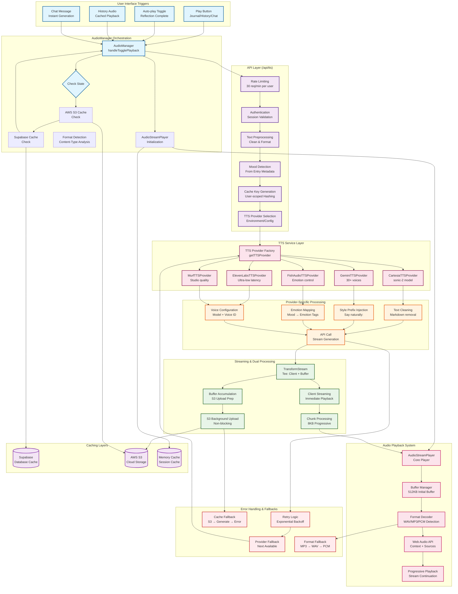

## Detailed Step-by-Step TTS Generation Sequence

### Phase 1: User Interaction & Initial Checks
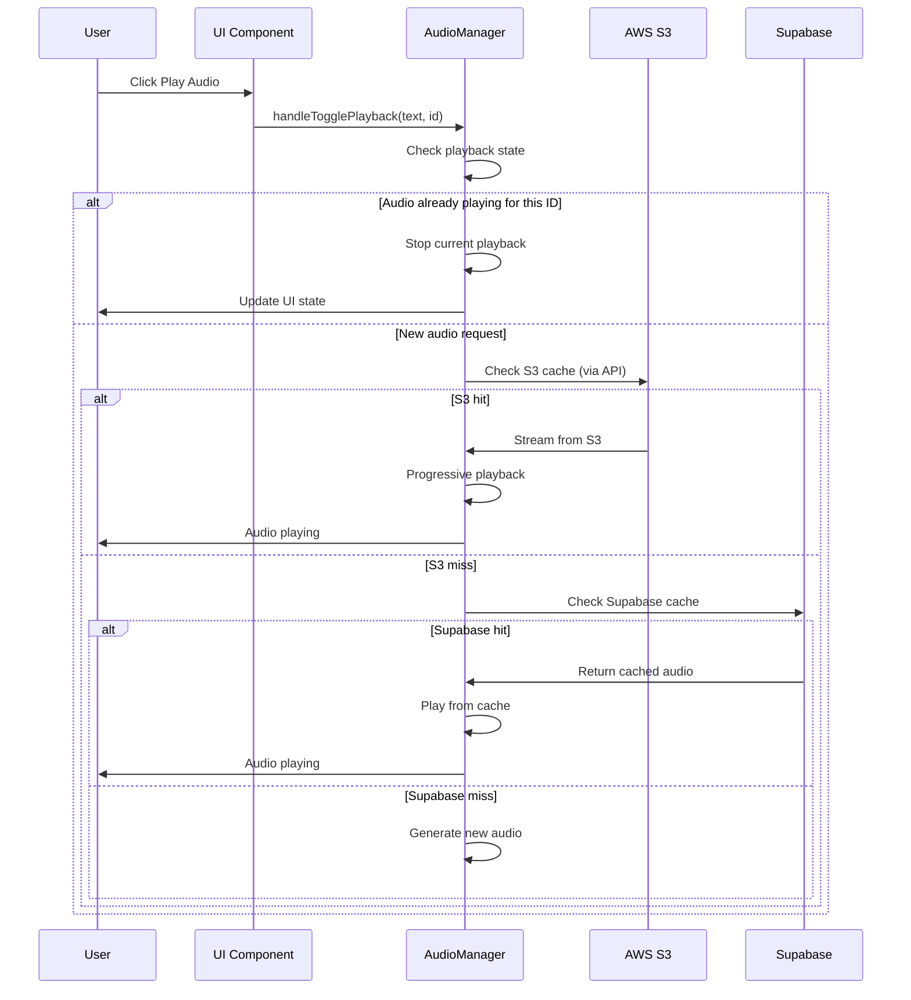

### Phase 2: API Processing & Provider Selection
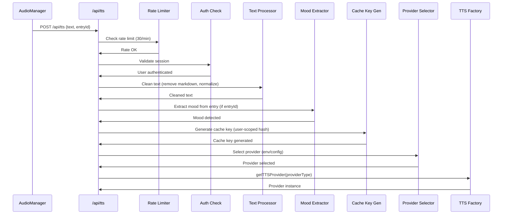

### Phase 3: Provider-Specific Processing
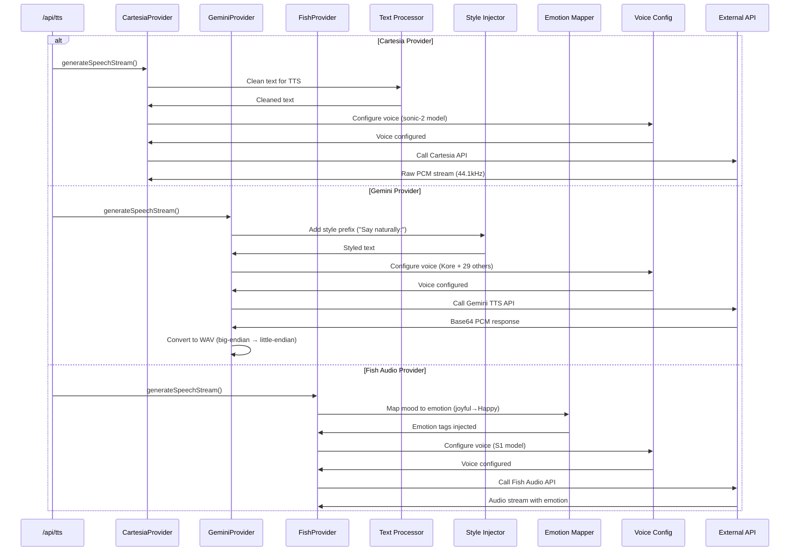

### Phase 4: Streaming & Dual Processing
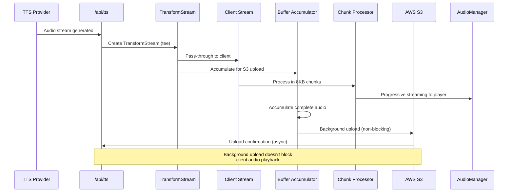

### Phase 5: Client-Side Audio Playback
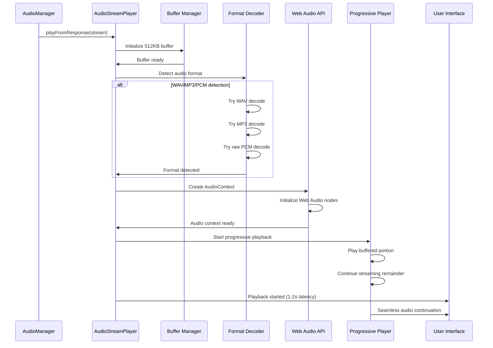

## Provider-Specific Implementation Details

### Cartesia TTS Flow
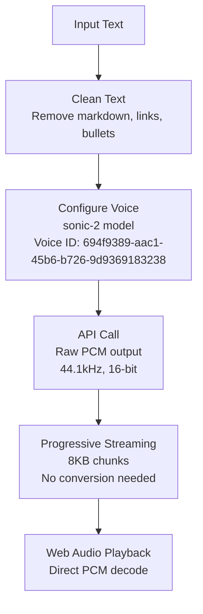

### Gemini TTS Flow
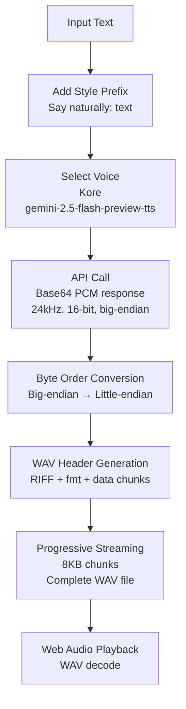

### Fish Audio Emotion Mapping
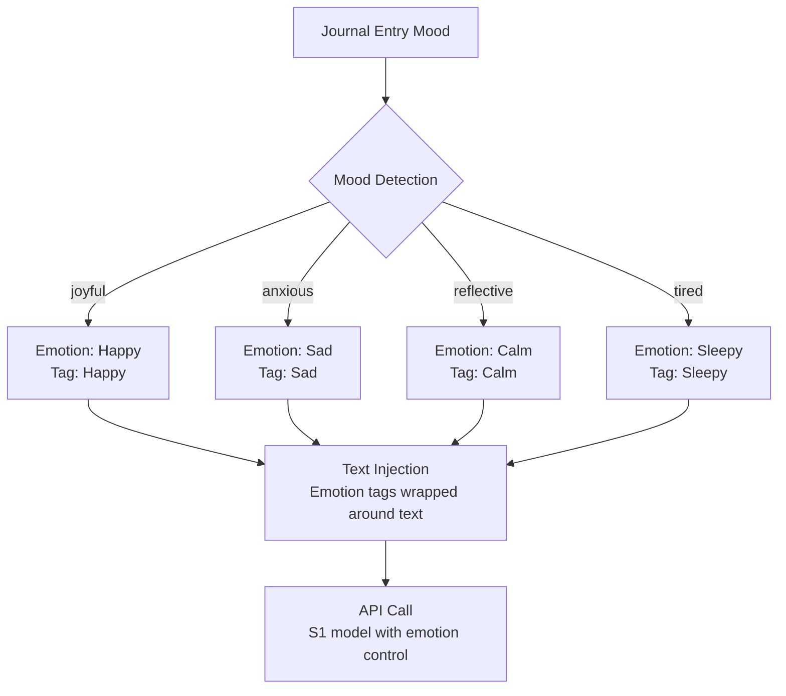

## Performance Characteristics

### Latency Breakdown (Target: 1-2 seconds)
```mermaid
gantt
    title TTS Generation Latency (Target: 1-2s total)
    dateFormat x
    axisFormat %S

    section Network/API
    DNS Resolution     :done, 0, 100ms
    API Call          :done, 100ms, 800ms
    Initial Response  :done, 900ms, 200ms

    section Processing
    Text Cleaning     :done, 0, 50ms
    Format Conversion :done, 50ms, 150ms
    Buffer Setup      :done, 200ms, 100ms

    section Streaming
    First Chunk       :done, 300ms, 100ms
    Buffer Fill (512KB):done, 400ms, 600ms
    Playback Start    :done, 1000ms, 100ms

    section Total
    End-to-End        :done, 0, 1200ms
```

### Cache Hit Rates (Expected Performance)
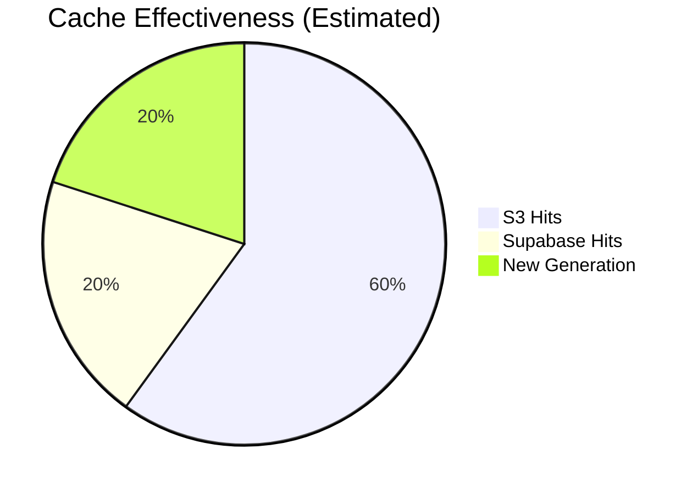

## Error Recovery Patterns

### Provider Fallback Chain
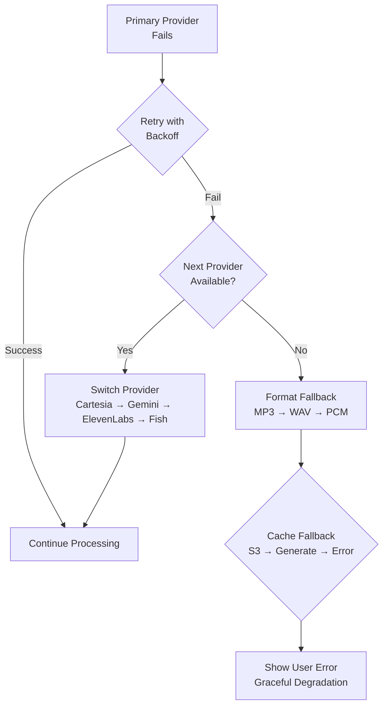

### Mobile-Specific Optimizations
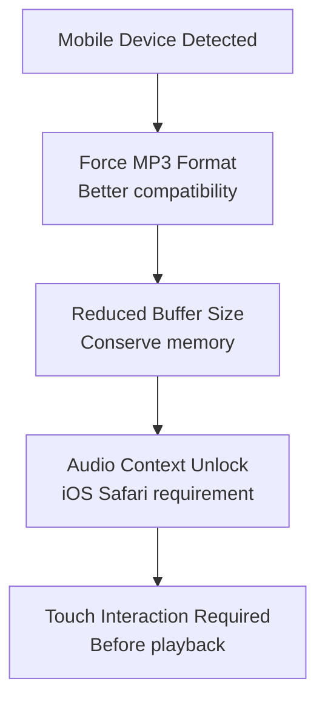

---

## Key TTS Architecture Principles

### **Progressive Enhancement**
- Audio starts playing within 1-2 seconds
- Seamless transition from buffered to streaming audio
- Graceful fallback for unsupported formats

### **Multi-Layer Caching**
- **Supabase**: Database-backed persistence (server-side)
- **S3**: Cross-device cloud storage (CDN delivery)
- **Memory**: Session optimization (temporary)

### **Provider Redundancy**
- 5 different TTS providers available
- Automatic failover on errors
- Cost optimization through provider selection

### **Streaming Optimization**
- Dual processing: client + S3 simultaneously
- Background uploads don't block playback
- Chunked streaming for smooth delivery

### **Error Resilience**
- Exponential backoff retry logic
- Format detection and fallback
- User-friendly error messages

This detailed TTS workflow ensures reliable, high-performance audio generation with multiple fallback mechanisms and optimization strategies for the best user experience.This detailed TTS workflow ensures reliable, high-performance audio generation with multiple fallback mechanisms and optimization strategies for the best user experience.
